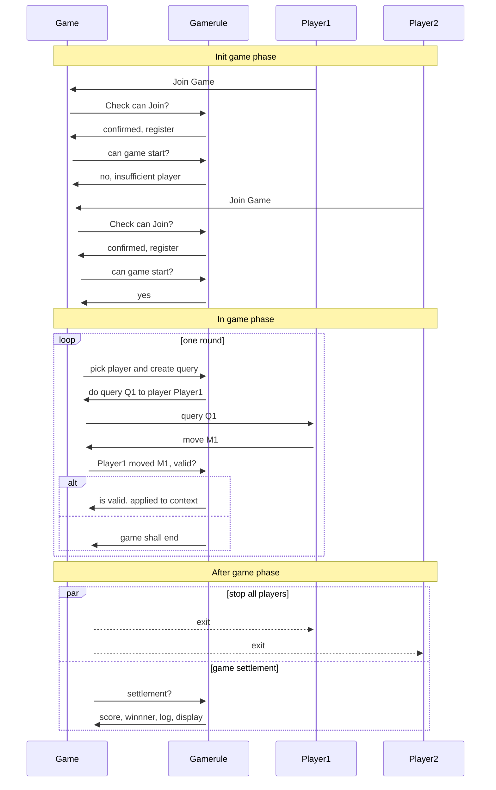

# Botzone

```mermaid
sequenceDiagram
    participant Game
    participant Gamerule
    participant Player1    
    participant Player2

	Note over Game, Player2: Init game phase
	Player1->>+Game: Join Game
	Game->>+Gamerule: Check can Join?
	Gamerule->>+Game: confirmed, register
	Game->>+Gamerule: can game start?
	Gamerule->>+Game: no, insufficient player
	Player2->>+Game: Join Game
	Game->>+Gamerule: Check can Join?
	Gamerule->>+Game: confirmed, register
	Game->>+Gamerule: can game start?
	Gamerule->>+Game: yes
	Note over Game, Player2: In game phase
	loop one round
        Game->>+Gamerule: pick player and create query
        Gamerule->>+Game: do query Q1 to player Player1
        Game->>+Player1: query Q1
        Player1->>+Game: move M1
        Game->>+Gamerule: Player1 moved M1, valid?
        alt
        	Gamerule->>+Game: is valid. applied to context
        else
        	Gamerule->>+Game: game shall end
        end
	end
	Note over Game, Player2: After game phase
	par stop all players
        Game-->>Player1: exit
        Game-->>Player2: exit
    and game settlement
    	Game->>Gamerule: settlement?
    	Gamerule->>Game: score, winnner, log, display
	end
```